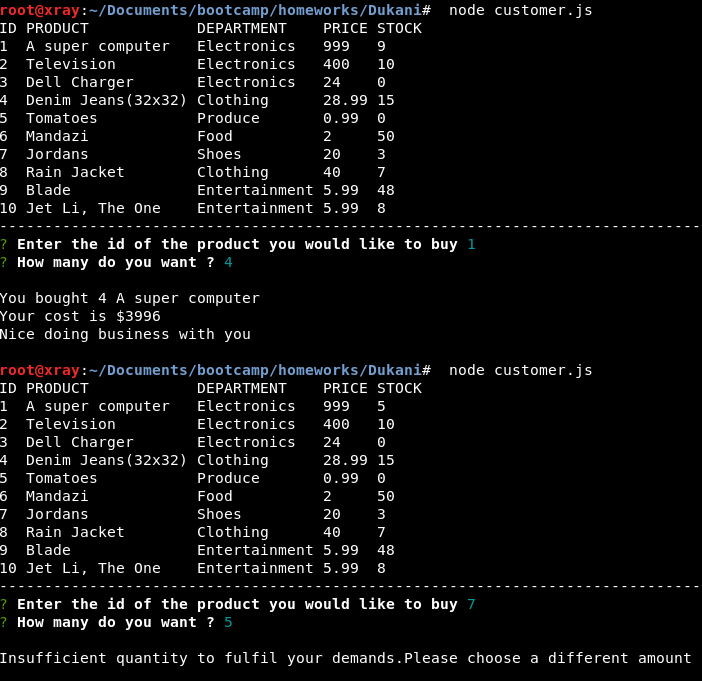

# Dukani aka The Shop

###A simple store manager tying to make a difference! 
---
##Requirements;
```
  mysql
  node
  npm
```
---

###How to use!

Clone the repository and install necessary packages through your terminal/bash
```
git clone https://github.com/hmalle/Dukani.git
cd Dukani
npm i
```
---

To run the program an sql database of the schema below is required
which can be obtained initialized using the file biasharaSeed.sql
```
+----+--------------------+---------------+--------+-------+
| id | product            | department    | price  | stock |
+----+--------------------+---------------+--------+-------+
|  1 | A super computer   | Electronics   | 999.00 |  5.00 |
|  2 | Television         | Electronics   | 400.00 | 10.00 |
|  3 | Dell Charger       | Electronics   |  24.00 |  0.00 |
|  4 | Denim Jeans(32x32) | Clothing      |  28.99 | 15.00 |
|  5 | Tomatoes           | Produce       |   0.99 |  0.00 |
|  6 | Mandazi            | Food          |   2.00 | 50.00 |
|  7 | Jordans            | Shoes         |  20.00 |  3.00 |
|  8 | Rain Jacket        | Clothing      |  40.00 |  7.00 |
|  9 | Blade              | Entertainment |   5.99 | 48.00 |
| 10 | Jet Li, The One    | Entertainment |   5.99 |  8.00 |
+----+--------------------+---------------+--------+-------+
```
---

When all is set you
```
node customer.js
```


